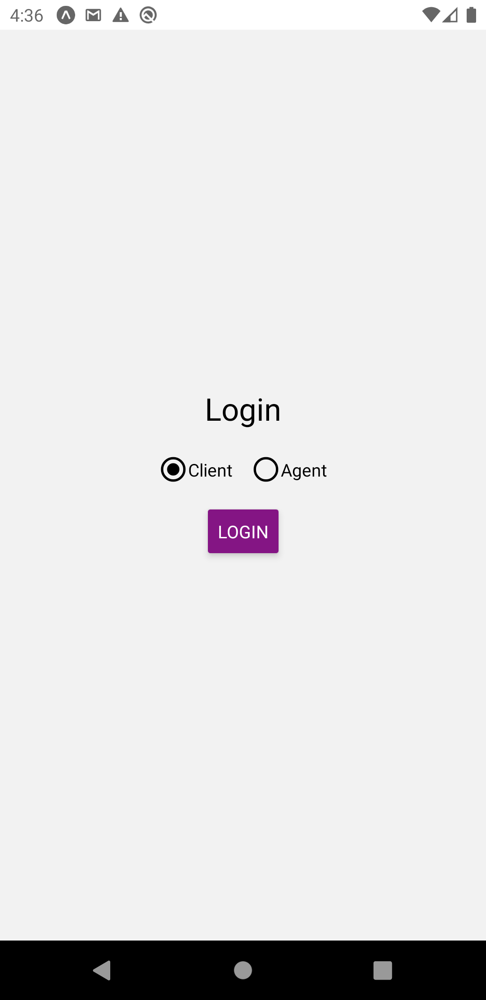
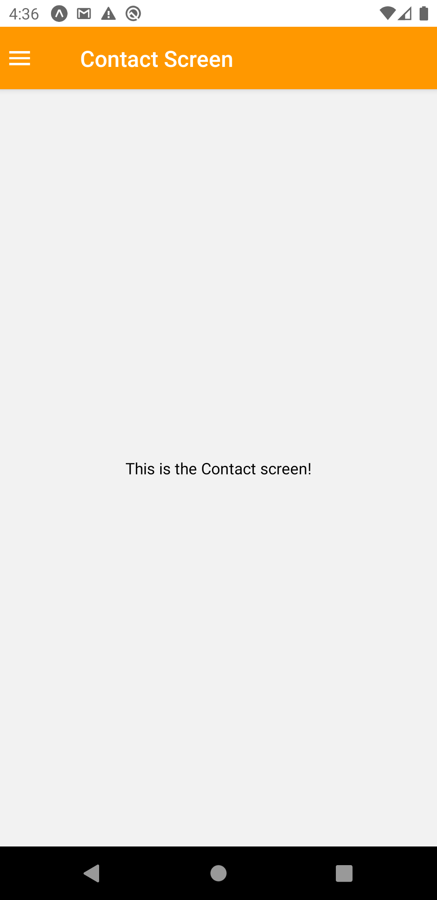
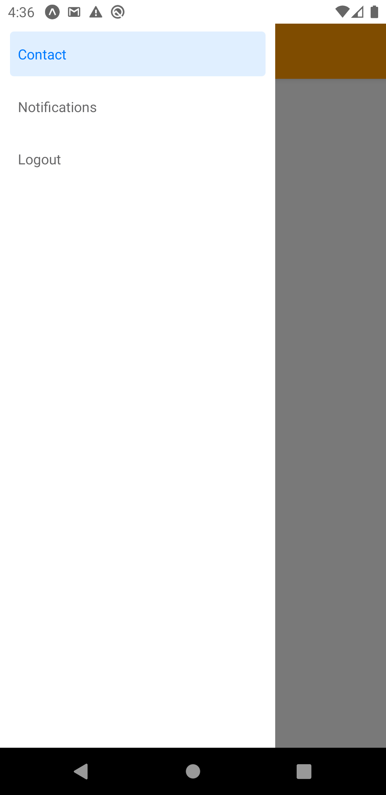
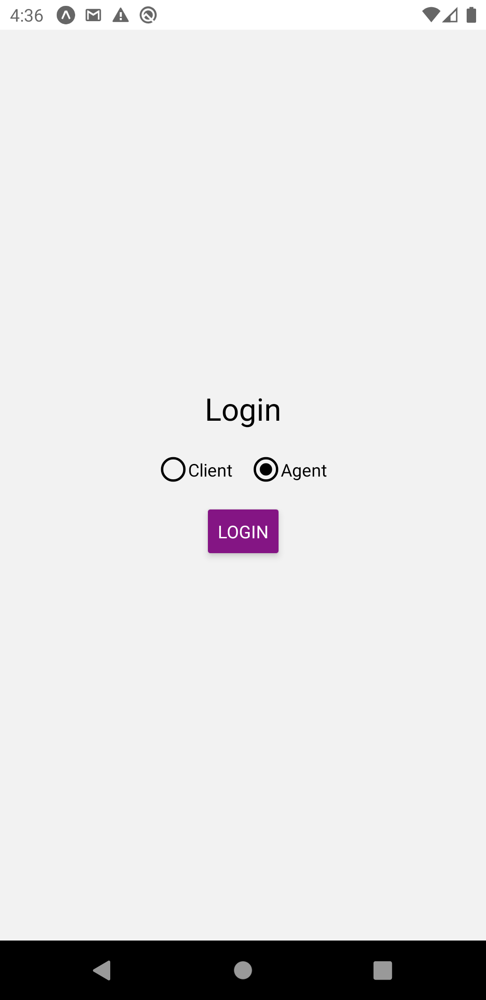
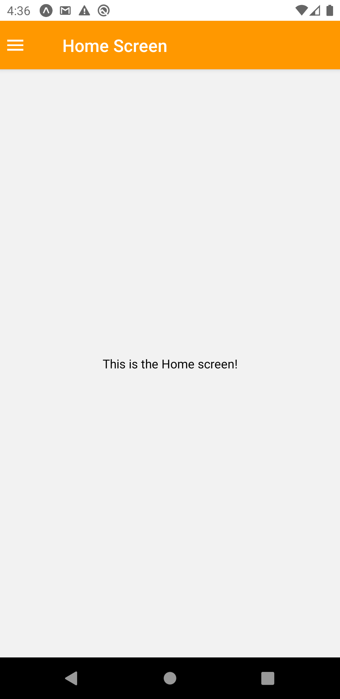

# expo-project

Display drawer switch agent or client wise login.
 

 In this tutorial, we'll make a Display drawer switch agent or client wise login.
  

 

    
    
    
    
     

     

                                                                                                
Running the project

 
Assuming you have all the requirements installed, you can setup and run the project by running:

* yarn install to install the dependencies
* run the following steps for your platform
* yarn start

 › run on Android device/emulator, or i to run on iOS simulator, or w to run on web.
 › show info on connecting new devices.
 › open DevTools in the default web browser.
 › disable automatically opening DevTools at startup.
 › send an app link with email.
 › toggle production mode. (current mode: development)
 › restart bundler, or shift-r to restart and clear cache.
